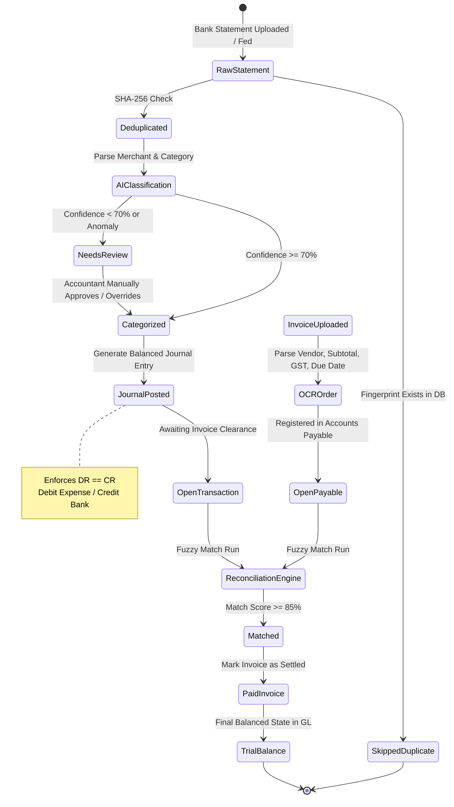

# LedgerAI - Autonomous Double-Entry Accounting & Reconciliation Platform

<div align="center">

[](./brag.mp4)

**🎥 [Watch 60s Live Product Walkthrough in HD MP4 (`brag.mp4`)](./brag.mp4)** &bull; **[Raw Video Stream](./brag.mp4)**

</div>

> **LedgerAI** is an audit-grade, AI-driven financial operating system that bridges raw bank statements, invoice documents, and strict double-entry bookkeeping. It guarantees mathematical accounting invariants ($\sum \text{Debits} = \sum \text{Credits}$), deduplicates transactions with SHA-256 fingerprints, provides multi-factor fuzzy reconciliation, and offers conversational ledger intelligence.

---

## Table of Contents

1. [User Onboarding & Module-by-Module Walkthrough](#user-onboarding--module-by-module-walkthrough)
   - [The 5-Minute Daily Flow](#the-5-minute-daily-flow)
   - [Module Walkthrough (11 Fully Integrated Modules)](#module-walkthrough)
     - [1. Dashboard (Command Center & Executive Metrics)](#1-dashboard-command-center)
     - [2. Transactions & Feed (Real-Time Ingestion & Categorization)](#2-transactions-bank-feed--ai-classification)
     - [3. Auto-Posting Rules & Policy Engine](#3-custom-auto-posting-rule-builder--policy-engine)
     - [4. Invoices & OCR Parser (Accounts Payable)](#4-invoices-accounts-payable--ocr-reader)
     - [5. Vendor Intelligence & Statutory Tax (TDS & GST ITC)](#5-vendor-intelligence--statutory-tax-engine-tds--gst-itc)
     - [6. 3-Way Multi-Factor Reconciliation](#6-reconciliation-3-way-multi-factor-fuzzy-matching)
     - [7. General Ledger & Trial Balance](#7-general-ledger-double-entry-books--trial-balance)
     - [8. Automated Financial Statements (P&L and Balance Sheet)](#8-automated-financial-statements-pl--balance-sheet)
     - [9. Multi-Currency FX Engine (Gain/Loss Booking)](#9-multi-currency-real-time-conversion--fx-gainloss-engine)
     - [10. Maker-Checker Dual Approval & Chained Audit Trail](#10-maker-checker-dual-control--tamper-evident-audit-timeline)
     - [11. AI Anomaly & Fraud Detection](#11-ai-anomaly--fraud-detection-engine)
     - [12. AI Copilot (SQL-Grounded Assistant)](#12-ai-copilot-conversational-financial-intelligence)
   - [Theme Switching & Instant System Reset](#theme-switching-black--white-modes-and-system-reset)
   - [In-App Contextual Guides & Info System ("i" Buttons)](#in-app-contextual-guides--info-system-i-buttons)
2. [Real-Time SQLite Architecture (Zero Hardcoding)](#real-time-sqlite-architecture-zero-hardcoding)
3. [End-to-End Accounting Lifecycle](#end-to-end-accounting-lifecycle)
4. [Complete Database Schema (SQLite 3 WAL)](#complete-database-schema-sqlite-3-wal)
5. [API & Python Engine Architecture](#api--python-engine-architecture)
6. [Mathematical Accounting Invariants](#mathematical-accounting-invariants)
7. [Running the Application](#running-the-application)

---

## User Onboarding & Module-by-Module Walkthrough

Welcome to **LedgerAI**! As a new user (founder, finance leader, accountant, or auditor), think of LedgerAI as your autonomous financial operating system. It ingests messy bank statements and vendor invoices, classifies them with explainable accounting rules, balances your double-entry general ledger, matches transactions against bills, enforces statutory tax rules (TDS, GST), and lets you query your finances in plain English.

### The 5-Minute Daily Flow
Your everyday routine follows an intuitive flow:
```
1. Transactions ──────► 2. Invoices ──────► 3. Reconciliation ──────► 4. General Ledger ──────► 5. Financial Statements
  (Review & Post)        (Upload Bills)       (Match 1-Click)          (Audit Books)           (P&L / Balance Sheet)
```

---

### Module Walkthrough (Deep Explanation of Every Module)

#### 1. Dashboard (Executive Command Center & Real-Time Invariants)
*The central nervous system where founders, CFOs, and finance leaders begin their day with instant visibility into company financial health.*
* **Core Functionality**: Queries the embedded SQLite General Ledger (`ledger.db`) in real time to present key operational and balance sheet metrics without waiting for prolonged month-end closes.
* **Deep Mechanics & Calculations**:
  * **Cash Runway & Net Monthly Burn**: Evaluates trailing 30-day outflows across operating expenses against current liquid treasury reserves (HDFC Operating + ICICI Treasury) to compute exact remaining runway months.
  * **Zero-Variance Invariant Badge**: Directly aggregates all ledger journal legs; when $\sum \text{Debits} = \sum \text{Credits}$, displays a prominent `GL BALANCED` badge.
  * **Category Spend Heatmap**: Breaks down expenditures across Cloud Infrastructure (GL 6100), SaaS Software (GL 6200), Contractor Services (GL 6300), and Marketing (GL 6400).
  * **Operational Alert Banners**: Surfaces items requiring immediate human attention—such as unreviewed bank transactions, invoices pending maker-checker sign-off, or GST ITC mismatches.
* **Navigation & Interaction**: Direct single-click routing to review queues or invoice modals, plus instant toggling between High-Contrast Dark Mode and Crisp Light Mode.

#### 2. Transactions (Bank Feed & AI Classification Engine)
*Where messy, unstructured raw bank statements are transformed into audit-grade double-entry accounting records.*
* **Core Functionality**: Ingests statements from corporate banking portals (HDFC, ICICI, Silicon Valley Bank, etc.) via Excel/CSV imports, deduplicates entries, and applies autonomous AI classification.
* **Deep Mechanics**:
  * **SHA-256 Deduplication Fingerprinting**: Computes a unique cryptographic hash for every row based on `date + amount + raw_description + reference_no`. Re-uploading statement files automatically skips existing transactions.
  * **AI Classification & COA Mapping**: Analyzes vendor memos and patterns to assign appropriate Chart of Accounts (COA) codes (e.g., `AWS EMEA` $\rightarrow$ `6100 Cloud Infrastructure`, `GitHub` $\rightarrow$ `6200 Software`).
  * **Multi-Factor Confidence Scoring**: Calculates a confidence score (0-100%) for every prediction based on vendor history, transaction amount thresholds, and text token matching.
  * **Transparent Explainability Panel**: Explains the exact rationale behind every AI classification (e.g., *"Matched historical pattern for Amazon Web Services with 98.4% certainty"*).
* **Controller Controls**: Single-click batch approval for staged transactions exceeding confidence thresholds ($\ge 70\%$), inline manual overrides for target accounts, and instant posting to the General Ledger.

#### 3. Auto-Posting Rules Engine & Policy Builder
*Empowers controllers and finance teams to implement deterministic automation rules that complement probabilistic AI models.*
* **Core Functionality**: Allows financial controllers to establish strict "If/Then" routing rules that automatically classify, route, or approve recurring corporate transactions.
* **Deep Mechanics**:
  * **Visual Conditional Rule Creator**: Build rules specifying criteria: field (`Description`, `Amount`, `Vendor`), comparison operators (`contains`, `equals`, `greater_than`, `less_than`), threshold limits, priority rankings, and target GL account codes.
  * **90-Day Backtesting Simulator**: Before activating any rule, the built-in simulator tests the rule logic against historical transactions stored in SQLite, projecting auto-approval rates and prevented errors.
  * **Enterprise Policy Thresholds**: Configurable system-wide governance cutoffs:
    * *Auto-Post Threshold* (default $\ge 95\%$): Automatically posts to the General Ledger without manual intervention.
    * *Review Queue Threshold* (default $\ge 80\%$): Flags transactions for human review.
    * *Dual-Approval Required Threshold* (default $\ge ₹100,000$): Requires secondary maker-checker sign-off before posting.

#### 4. Invoices (Accounts Payable & Intelligent OCR Parser)
*The centralized accounts payable command center for tracking vendor liabilities, invoice documents, and payment milestones.*
* **Core Functionality**: Manages the complete lifecycle of vendor bills—from initial document ingestion and optical character recognition (OCR) to approval, payment, and settlement.
* **Deep Mechanics**:
  * **Multi-Format Ingestion**: Supports drag-and-drop uploads of PDF invoices, scanned receipt images, or JSON payloads.
  * **Intelligent Document Extraction**: Automatically parses vendor identity, GSTIN/PAN, tax invoice numbers, line item details, taxable amounts, CGST/SGST/IGST splits, and payment due dates into SQLite `invoices`.
  * **Payables Status Tracking**: Monitors invoices across distinct lifecycle states: `Unpaid`, `Partially Paid`, `Matched / Settled`, and `Overdue`.
  * **Integrated Governance Modals**: Direct modal triggers for **Maker-Checker Dual Approval**, **Multi-Currency FX Gain/Loss Calculations**, and **Cryptographic Audit Timelines**.

#### 5. Vendor Intelligence & Statutory Tax Engine (TDS & GST ITC)
*Automates corporate compliance under Indian Income Tax (TDS) and Goods & Services Tax (GST) statutory frameworks.*
* **Core Functionality**: Centralizes vendor master records, payment terms, tax deduction at source (TDS) withholdings, and Input Tax Credit (ITC) reconciliation.
* **Deep Mechanics**:
  * **Vendor Master Directory**: Maintains vendor corporate identities, verified GSTIN/PAN formats, default GL expense accounts, payment terms (Net 15/30/45), YTD billed amounts, YTD disbursements, and open balances.
  * **Automated Indian TDS Withholding Calculator**:
    * *Section 194C* (Contracts & Subcontractors: 1% Individual / HUF, 2% Company)
    * *Section 194J* (Professional, Technical & Royalty Services: 10% or 2% for call centers)
    * *Section 194I* (Rent: 10% on Land/Building, 2% on Plant/Machinery)
    * Computes net payable amounts post-deduction and automatically books statutory withholding liabilities to `2100 Statutory TDS Payable`.
  * **GSTR-2B Input Tax Credit (ITC) Reconciliation**: Compares invoice-level GST claims against simulated GSTN portal vendor filings, identifying `MATCHED_2B` vs. `PENDING_PORTAL_MATCH` discrepancies to prevent non-compliant tax credits.

#### 6. 3-Way Multi-Factor Reconciliation Engine
*Eliminates the most tedious accounting bottleneck: tying bank statement disbursements to authorizing vendor invoices.*
* **Core Functionality**: Continuously scans unreconciled bank transactions and pending vendor invoices, calculating mathematical match probabilities using a weighted multi-factor scoring matrix.
* **Scoring Weight Distribution**:
  * **Amount Match (35%)**: Exact monetary equality or partial installment match within acceptable tolerance.
  * **Vendor Name Match (25%)**: Normalized string similarity, token sort algorithms, and Levenshtein distance matching.
  * **Reference & Invoice Code Match (25%)**: Regex-based extraction of invoice numbers, PO numbers, and alphanumeric bill codes from bank memo strings.
  * **Date Proximity (15%)**: Decaying probability curve evaluated over a configurable window ($\pm 7$ to $\pm 30$ days).
* **Batch Reconciliation**: Controllers can review high-confidence matches ($\ge 85\%$, highlighted in emerald green) and execute 1-click batch reconciliations, automatically updating both records and closing open payables.

#### 7. General Ledger & Double-Entry Books (Zero-Variance Books & Trial Balance)
*The immutable, audit-ready source of truth for the company's complete financial history.*
* **Core Functionality**: Strictly enforces compound double-entry bookkeeping principles. Every financial event generates balanced journal vouchers where:
  $$\sum \text{Debits} = \sum \text{Credits}$$
* **Deep Mechanics**:
  * **Compound Journal Vouchers**: Records multi-leg journal entries with account codes, debit/credit splits, line narrations, source modules, and approval stamps.
  * **Chart of Accounts (COA) Filtering**: Filter ledger entries by specific asset, liability, equity, revenue, or expense accounts to audit itemized ledger activity.
  * **Real-Time Trial Balance**: Aggregates debit and credit volume across all active accounts with zero variance, providing immediate mathematical proof of balanced books.
  * **Voucher Detail Audit Modal**: Inspect any journal entry to review its audit timestamps, source modules, and verified immutable SHA-256 hash.
  * **Export to Excel (.xlsx)**: One-click export of the full Trial Balance with account codes, category types, and ending balances.

#### 8. Automated Financial Statements (P&L & Balance Sheet Invariant Check)
*Generates audit-ready financial statements directly from live General Ledger balances with zero hardcoded numbers.*
* **Core Functionality**: Eliminates manual closing spreadsheets by aggregating SQLite account balances in real time into standardized financial reporting structures.
* **Statements & Components**:
  * **Profit & Loss (Income Statement)**:
    * *Operating Revenue (I)*: SaaS subscription income (GL 4000), professional services (GL 4100), and realized FX gains.
    * *Cost of Goods Sold (II)*: Direct compute and hosting costs (GL 5000) subtracted to compute **Gross Profit** and **Gross Margin %**.
    * *Operating Expenses (III)*: Cloud infrastructure (GL 6100), software tools (GL 6200), contractor payroll (GL 6300), marketing (GL 6400), office rent (GL 6500), and utilities (GL 6600) subtracted to compute **Operating EBITDA** and **Operating Margin %**.
    * *Statutory Taxes & Net Profit (IV)*: Provision for statutory taxes (GL 8000) subtracted to compute final **Net Profit** and **Net Margin %**, automatically carried forward to Retained Earnings.
  * **Balance Sheet**:
    * *Assets*: Current Assets (Operating bank balances, Treasury reserves, Accounts Receivable, Input GST ITC) and Non-Current Assets (Equipment & Security Deposits).
    * *Liabilities*: Current Liabilities (Accounts Payable, Statutory TDS Payable, Accrued Expenses).
    * *Shareholders' Equity*: Common Share Capital, Retained Earnings, and Current Period Net Income.
    * *Fundamental Accounting Identity Check*: Programmatically proves $\text{Assets} = \text{Liabilities} + \text{Equity}$ with exact $\Delta = ₹0.00$ variance.
  * **Multi-Format Export**: Generates multi-tab audit workbooks in Excel (.xlsx) and printable PDF financial summaries.

#### 9. Multi-Currency Real-Time Conversion & FX Gain/Loss Engine
*Handles cross-border SaaS subscriptions, overseas contractor wires, and multi-currency bank accounts.*
* **Core Functionality**: Manages live exchange rate spreads for major global trade currencies (USD, EUR, GBP, AED, SGD, JPY) against INR.
* **Deep Mechanics**:
  * **Real-Time FX Board**: Live market exchange rates, daily spreads, and timestamped quote feeds.
  * **Realized vs. Unrealized Gain/Loss Engine**:
    * Compares the booking exchange rate (on invoice issue date) against the settlement exchange rate (on bank wire date).
    * Automatically calculates foreign exchange gains or losses and books offsetting compound journal entries directly to `8100 Realized Foreign Exchange Gain / Loss`.

#### 10. Maker-Checker Dual Control & Cryptographic Chained Audit Timeline
*Enterprise-grade financial governance enforcing segregation of duties and tamper-evident audit trails.*
* **Core Functionality**: Prevents unauthorized capital disbursements and provides auditors (Big 4, tax inspectors) with cryptographic verification of every ledger alteration.
* **Deep Mechanics**:
  * **Maker-Checker Separation of Duties**: Any transaction or invoice exceeding configurable limits (e.g., $\ge ₹100,000$) cannot be unilaterally posted by a single user. It enters a pending queue requiring secondary review and signature from a Controller or Finance Officer.
  * **Cryptographic Chained Timeline**: Every state change (creation, AI classification, rule match, manual edit, approval) is recorded in `audit_timeline` with a chained SHA-256 checksum:
    $$\text{Checksum} = \text{SHA-256}\Big(\text{prev\_hash} \,\|\, \text{entity\_id} \,\|\, \text{action} \,\|\, \text{timestamp} \,\|\, \text{user}\Big)$$
  * Any post-facto tampering immediately breaks the cryptographic verification chain.

```
+---------------------------------------------------------------------------------------------+
|                   MAKER-CHECKER GOVERNANCE & CRYPTOGRAPHIC AUDIT TIMELINE                   |
+---------------------------------------------------------------------------------------------+

   Step 1: Initiation (Maker)
   -------------------------
   Finance Associate inputs/approves transaction >= ₹1,00,000 threshold.
   Transaction enters status: PENDING_DUAL_APPROVAL.
             |
             v
   Step 2: Segregation of Duties Enforcement
   -----------------------------------------
   Same user CANNOT approve their own submission.
   System triggers alert on Controller Dashboard.
             |
             v
   Step 3: Verification & Sign-off (Checker)
   -----------------------------------------
   Authorized Controller reviews source document, line splits, and GL mapping.
   Controller clicks "Authorize & Post".
             |
             v
   Step 4: Chained SHA-256 Checksum Generation
   -------------------------------------------
   Block[N] Hash = SHA-256( PrevHash + EntityID + Action + Timestamp + User + Status )

   +--------------------------+        +--------------------------+
   |  Audit Entry N - 1       |        |  Audit Entry N           |
   |  Action: CREATED         | =====> |  Action: DUAL_APPROVED   |
   |  User: Assoc. Accountant |  Hash  |  User: Senior Controller |
   |  Hash: a8f4...e120       |  Link  |  Hash: c3d1...99ef       |
   +--------------------------+        +--------------------------+
```

#### 11. AI Anomaly & Fraud Detection Engine
*Continuous background monitoring for enterprise risk management, duplicate payment prevention, and anomaly detection.*
* **Core Functionality**: Evaluates every bank transaction and invoice against statistical baselines established from historical SQLite records.
* **Deep Mechanics**:
  * **Financial Health Score (0-100%)**: Continuous risk scoring reflecting transaction stability, reconciliation hygiene, and tax compliance.
  * **Duplicate Invoice Shield**: Flags duplicate bills having identical invoice numbers, reference codes, or matching amounts from the same vendor within a 30-day window.
  * **Vendor Variance Spikes**: Automatically flags bills or charges that exceed the trailing vendor average by $\ge 25\%$.
  * **Off-Hours & Weekend Anomaly Detection**: Highlights corporate card expenses processed during weekends or irregular non-business hours.

#### 12. AI Copilot (Conversational SQL-Grounded Financial Intelligence)
*An intelligent 24/7 financial analyst grounded in your actual database.*
* **Core Functionality**: Translates natural language questions from founders and accountants into safe SQL queries against the live SQLite ledger, analyzing trends and returning formatted metrics, tables, and direct deep links.
* **Example Questions You Can Ask**:
  * *"What were our top 3 highest expenses this month?"*
  * *"Show all unreconciled payments to Google or AWS."*
  * *"What is our current monthly burn rate and projected cash runway?"*
  * *"Give me a breakdown of SaaS software subscriptions."*
  * *"Are our debits and credits balanced right now?"*

```
+---------------------------------------------------------------------------------------------+
|                         REAL-TIME AI FINANCIAL COPILOT ENGINE                               |
+---------------------------------------------------------------------------------------------+

   User Natural Language Query (e.g., "What is our liquid cash and open payables?")
                                  |
                                  v
   +---------------------------------------------------------------+
   |               EXPRESS ORCHESTRATOR (server.ts)                |
   |  - Gathers live context snapshot from SQLite via Python engine|
   |  - Enforces prompt system constraints:                        |
   |      * Zero emojis, strictly bold markdown, real figures      |
   |      * Exact mathematical accounting terms                    |
   |      * Verification against fundamental invariants            |
   +------------------------------+--------------------------------+
                                  |
                +-----------------+----------------+
                |                                  |
                v                                  v
   [ Context Assembly (/api/ai/context) ]    [ LLM Processing (Gemini 2.5 / Python) ]
   - Liquid Treasury (HDFC + ICICI)          - Synthesizes exact financial data
   - GL Variance Status (DR == CR)           - Generates structured breakdown
   - Top Open Payables & TDS Sections        - Formats bold numbers and tables
   - Trailing Ledger Vouchers & Feed Lines   - Suggests clickable deep links
                |                                  |
                +-----------------+----------------+
                                  |
                                  v
   +---------------------------------------------------------------+
   |                    REACT 18 COPILOT VIEW                      |
   |  - 4 Live Pulse Cards (Treasury, Invariance, AP, Feed)        |
   |  - Instant Prompt Question Templates                          |
   |  - Markdown-rendered thread with clear bolding and tables     |
   |  - Quick Navigation Deep Links into Ledger, Invoices, Tax     |
   +---------------------------------------------------------------+
```

---

### Navigation Architecture & Theme Modes

* **Direct Header Navigation**:
  * All modules are directly accessible via the top global navigation bar—eliminating redundant sub-tab bars and outer card wrappers for maximum workspace efficiency and direct access.
* **Black & White Mode Switch**:
  * Click the **Sun / Moon** icon in the top header anytime to switch between the **OLED Deep Black Theme** (high contrast, optimized for low eye-strain) and the **Pristine Light Theme** (clean slate and crisp typography).
  * High-contrast styling is enforced across all tables, badges, account tags, and calendar pickers.
* **System Reset**:
  * Click **Reset System** in the top navigation bar to restore the embedded SQLite database (`ledger.db`) to its initial balanced demo state at any time.

---

### In-App Contextual Guides & Info System ("i" Buttons)

Every page across LedgerAI features dedicated, interactive contextual guides and mathematical tooltips designed for controllers, finance managers, and auditors:

```
+---------------------------------------------------------------------------------------------+
|                     CONTEXTUAL IN-APP GUIDE & EXPLAINABILITY SYSTEM                         |
+---------------------------------------------------------------------------------------------+

   Page Header Trigger: [ (i) Guide ] Button
              |
              v
   +-----------------------------------------------------------------------+
   |                       TABBED PAGE INFO MODAL                          |
   |                                                                       |
   |  [ Overview ]                                                         |
   |  - Purpose of the module and business problem solved                  |
   |  - Step-by-step controller workflows and actions                      |
   |                                                                       |
   |  [ Accounting Rules & Invariants ]                                    |
   |  - Double-entry ledger invariants (Luca Pacioli compliance)           |
   |  - Maker-checker dual control thresholds (>= Rs 100,000)              |
   |  - Statutory tax compliance (TDS sections 194C/J, GSTR-2B ITC)       |
   |                                                                       |
   |  [ Key Metrics & Mathematical Formulas ]                              |
   |  - Exact formula breakdown (e.g., Burn Rate, Cash Runway, ITC)        |
   |  - Live citation of underlying SQLite tables and columns              |
   |                                                                       |
   |  [ Best Practices & Keyboard Shortcuts ]                              |
   |  - Hotkeys (Cmd+K for Command Palette, Esc to close)                  |
   |  - Recommended daily audit and reconciliation practices               |
   +-----------------------------------------------------------------------+

              AND

   Table & Card Inline Triggers: [ (i) Tooltip ]
              |
              v
   +-----------------------------------------------------------------------+
   |                      INLINE INTERACTIVE TOOLTIP                       |
   |  - Plain-text description of the metric, rate, or status badge        |
   |  - Mathematical formula breakdown (e.g., DR - CR == 0)                |
   |  - Zero mock values: refers directly to active database state         |
   +-----------------------------------------------------------------------+
```

#### Coverage Matrix Across Modules

| Module / Page | Header "(i)" Guide Key | Inline Tooltips Provided |
| :--- | :--- | :--- |
| **Dashboard** | `dashboard` | Net Revenue, Total Expenses, Cash Runway, Net Burn, AI Automation Rate, Revenue vs Expenses, Recent Predictions, Action Required items |
| **Transactions Feed** | `transactions` | AI Confidence Score calculation, Transaction Status definitions (`POSTED`, `PENDING_REVIEW`, `FLAGGED`, `PENDING_DUAL_APPROVAL`) |
| **Transaction Details** | `transaction_details` | AI Classification Confidence Engine, Suggested Double-Entry Journal Entry, Debits vs Credits vouchers |
| **Invoices & AP** | `invoices` | Total Billed aggregation, Matched Reconciliation Rate, Statutory Tax (GST ITC), Invoice Status flags |
| **Reconciliation** | `reconciliation` | Auto-Match multi-factor confidence scoring formula, Variance Review Queue, Match Queue weight breakdown |
| **General Ledger & Books** | `ledger` | Luca Pacioli double-entry balanced invariant (`SUM(DR) == SUM(CR)`), Total Debit volume, Total Credit volume |
| **AI Copilot** | `copilot` | Liquid Treasury pulse, GL Invariance status, Open Payables count/total, Real-Time Data Feed ingestion counter |

---

---

## Real-Time SQLite Architecture (Zero Hardcoding)

LedgerAI operates on a strict **zero-mock, real-time persistence policy**:
- **No Hardcoded State**: Every financial metric, transaction row, invoice total, tax calculation, rule match, and balance sheet figure is computed live from the embedded SQLite database (`ledger.db`).
- **High Concurrency & Durability**: SQLite is initialized with `PRAGMA journal_mode=WAL` (Write-Ahead Logging), `PRAGMA foreign_keys=ON`, and `PRAGMA busy_timeout=5000` to support concurrent reads and writes between the web orchestrator and Python execution processes.
- **Python Execution Dispatcher**: Node.js/Express (`server.ts`) delegates analytical and double-entry tasks to Python modules (`/python/`) via a fast CLI dispatch layer (`python/engine.py`).

```
 ┌───────────────────────────────────────────────────────────────────────────────┐
 │                           REACT 18 VITE FRONTEND                              │
 │   • Dashboards, GL Statements, Rules Engine, Maker-Checker, FX, AP Directory  │
 └──────────────────────────────────────┬────────────────────────────────────────┘
                                        │ HTTP REST API (JSON)
                                        ▼
 ┌───────────────────────────────────────────────────────────────────────────────┐
 │                           EXPRESS SERVER (server.ts)                          │
 │   • Central API gateway & process orchestrator                                │
 │   • child_process.execFile("python3", ["python/engine.py", cmd, ...])         │
 └──────────────────────────────────────┬────────────────────────────────────────┘
                                        │ stdin / stdout (JSON payloads)
                                        ▼
 ┌───────────────────────────────────────────────────────────────────────────────┐
 │                       PYTHON 3.10 FINANCIAL ENGINE                            │
 │   • db.py, ledger.py, financial_statements.py, rules_engine.py, anomalies.py │
 │   • currency.py, dual_approval.py, vendor_tax.py, copilot.py, reconcile.py    │
 └──────────────────────────────────────┬────────────────────────────────────────┘
                                        │ Raw SQL Queries (Transactions & Aggregations)
                                        ▼
 ┌───────────────────────────────────────────────────────────────────────────────┐
 │                       SQLITE 3 DATABASE (ledger.db)                           │
 │   • WAL Mode | Foreign Keys | SHA-256 Chained Hashes | Zero Mock Data         │
 └───────────────────────────────────────────────────────────────────────────────┘
```

---

## Complete Database Schema (SQLite 3 WAL)

The system maintains 12 relational tables within `ledger.db`:

1. **`organizations`**: Master legal entity (`id`, `name`, `currency`, `created_at`).
2. **`users`**: User identities & RBAC roles (`id`, `organization_id`, `name`, `email`, `role`).
3. **`accounts`**: Chart of Accounts with live running balances (`code`, `name`, `type`, `balance`, `description`).
4. **`transactions`**: Raw bank feeds with SHA-256 deduplication hashes (`id`, `hash`, `date`, `amount`, `description`, `vendor`, `category`, `status`, `confidence_score`).
5. **`invoices`**: Accounts Payable bills with OCR extraction (`id`, `invoice_number`, `vendor_name`, `invoice_date`, `subtotal`, `tax`, `total`, `status`).
6. **`journal_entries`**: Header table for double-entry transactions (`id`, `date`, `description`, `reference_type`, `reference_id`, `created_at`).
7. **`journal_lines`**: Compound debit/credit splits enforcing $\sum DR = \sum CR$ (`id`, `journal_entry_id`, `account_id`, `type`, `amount`).
8. **`posting_rules`**: Deterministic controller automation rules (`id`, `name`, `condition_field`, `condition_operator`, `condition_value`, `min_amount`, `max_amount`, `target_category`, `target_gl_account`, `auto_approve`, `priority`, `is_active`).
9. **`confidence_policies`**: System-wide governance thresholds (`id`, `auto_post_threshold`, `review_threshold`, `dual_approval_threshold`, `is_dual_approval_enabled`).
10. **`vendors`**: Vendor directory with statutory tax tracking (`id`, `name`, `pan_gstin`, `category`, `default_gl_account`, `payment_terms`, `tds_section`, `tds_rate`, `gst_rate`, `total_billed`, `total_paid`).
11. **`audit_timeline`**: Cryptographic blockchain-style chained audit log (`id`, `timestamp`, `entity_type`, `entity_id`, `action`, `user_name`, `user_role`, `prev_status`, `new_status`, `details`, `ip_address`, `hash_checksum`).
12. **`exchange_rates`**: Real-time cross-currency rates (`currency`, `symbol`, `rate_to_inr`, `spread`, `last_updated`).

---

---

## End-to-End Accounting Lifecycle

The diagrams below detail the exact state transitions and data pipelines of a financial transaction from raw bank text to a reconciled, audited ledger entry:

```
+---------------------------------------------------------------------------------------------+
|                              END-TO-END ACCOUNTING PIPELINE                                 |
+---------------------------------------------------------------------------------------------+

   Bank Statement (Excel/CSV)                      Vendor Invoice (PDF/OCR)
               |                                              |
               v                                              v
    [ SHA-256 Deduplication ]                      [ Structured OCR Parser ]
   (Discards identical hashes)                   (Vendor, GSTIN, Line Items, Tax)
               |                                              |
               v                                              v
    [ AI Categorization & COA ]                    [ Accounts Payable Registry ]
   (Vendor Pattern, Conf >= 70%)                   (Recorded in SQLite invoices)
               |                                              |
               v                                              |
    [ Rules Engine & Policies ]                               |
   (If/Then Auto-Post & Approval)                             |
               |                                              |
               +-----------------------+                      |
               |                       |                      |
      Amount < ₹1,00,000      Amount >= ₹1,00,000             |
               |                       |                      |
               v                       v                      |
    [ Standard Auto-Post ]   [ Maker-Checker Sign-Off ]       |
               |             (Secondary Review Required)      |
               |                       |                      |
               +-----------+-----------+                      |
                           |                                  |
                           v                                  |
            [ Balanced Journal Voucher ]                      |
            (Invariant: Total DR == Total CR)                 |
                           |                                  |
                           v                                  v
       +------------------------------------+   +---------------------------+
       |   General Ledger (ledger.db)       |   | Open Payables (Unpaid)    |
       +-----------------+------------------+   +-------------+-------------+
                         |                                    |
                         +-----------------+------------------+
                                           |
                                           v
                       [ 3-Way Fuzzy Reconciliation Matrix ]
                         - Amount Match (35% weight)
                         - Vendor Similarity (25% weight)
                         - Reference Code (25% weight)
                         - Date Window Proximity (15% weight)
                                           |
                         Score >= 85%      |      Score < 85%
                     +---------------------+---------------------+
                     |                                           |
                     v                                           v
         [ Auto-Matched & Settled ]                  [ Staged Review Queue ]
         (Invoice Marked as Paid)                    (Side-by-Side Variance)
                     |
                     v
       +-------------------------------------------------------------+
       |                  FINANCIAL AUDIT REPORTS                     |
       |  Trial Balance (Delta = ₹0.00)  |  P&L Statement (EBITDA)   |
       |  Balance Sheet (A = L + E)       |  Cryptographic Timeline   |
       +-------------------------------------------------------------+
```



---

## Core Platform Capabilities

### 1. Bank Feed Ingestion & SHA-256 Deduplication
Bank statements frequently contain repeated lines or overlap when accountants upload monthly statements. LedgerAI creates a cryptographically unique fingerprint for every statement line:

$$\text{Fingerprint} = \text{SHA-256}\Big(\text{date} \,\|\, \text{description} \,\|\, \text{amount} \,\|\, \text{currency}\Big)$$

- **Deterministic**: The exact same transaction imported multiple times yields the same hash.
- **Zero Duplicates**: The database indexes `fingerprint UNIQUE`. Overlapping statement files skip existing hashes without corrupting account balances.
- **Supported Formats**: Native Microsoft Excel (`.xlsx`, `.xls`), CSV, and direct API endpoints.

---

### 2. AI Classification & Explainable COA Assignment
Rather than a "black-box" tagger, LedgerAI provides auditable justification for every category recommendation:
- **Entity Resolution**: Converts obscure bank memos (e.g., `GOOGLE*CLOUD_MUMBAI_IN 984129`) into recognized vendors (`Google Cloud Platform`).
- **Standard Chart of Accounts (COA)**: Direct mapping into standard 4-digit accounting codes (e.g., `1010` Bank, `2000` Accounts Payable, `4000` Sales Revenue, `6100` Cloud Infrastructure, `6300` Software Subscriptions).
- **Confidence Scoring**: Each prediction outputs a floating score between $0.00$ and $1.00$.
- **Explainability**: Outputs specific reasoning criteria (e.g., *"Matched recurring monthly tech spend pattern", "Known vendor tax ID identified"*).

---

### 3. Double-Entry General Ledger & Invariant Guard

#### The Fundamental Law of Accounting
Every economic transaction changes at least two accounts in opposing directions. The system enforces the fundamental accounting equation at the database layer:

$$\text{Assets} = \text{Liabilities} + \text{Equity}$$

$$\sum \text{Debits} - \sum \text{Credits} = 0$$

#### Debit & Credit Meaning:
| Account Class | Debit (DR) Action | Credit (CR) Action | Normal Balance |
| :--- | :--- | :--- | :--- |
| **Assets (1000s)** | **Increases** asset | **Decreases** asset | Debit |
| **Liabilities (2000s)** | **Decreases** liability | **Increases** liability | Credit |
| **Equity (3000s)** | **Decreases** equity | **Increases** equity | Credit |
| **Revenue (4000s)** | **Decreases** revenue | **Increases** revenue | Credit |
| **Expenses (6000s)** | **Increases** expense | **Decreases** expense | Debit |

#### The Invariant Guard:
If any module or user attempts to record a journal entry where $\sum \text{Debits} \neq \sum \text{Credits}$, the transaction is rejected with an `UnbalancedJournalEntryError`.

---

### 4. Invoice Processing & OCR Entity Extraction
Accounts Payable (AP) management allows drag-and-drop ingestion of vendor invoices, receipts, and tax filings:
- **Intelligent Field Parsing**: Extracts Invoice Number, Issue Date, Payment Due Date, Currency, Vendor Name, Tax ID, Subtotal, and GST/VAT taxes.
- **Tax Breakdown**: Separates base operating expenditure from recoverable tax credits.
- **Payment Lifecycle Tracking**: Invoices transition through `Unpaid` $\rightarrow$ `Pending Match` $\rightarrow$ `Reconciled / Paid` $\rightarrow$ `Overdue`.

---

### 5. 3-Way Multi-Factor Fuzzy Reconciliation
Bank statements show when cash leaves; invoices show what was purchased. LedgerAI executes a 4-dimensional fuzzy matching algorithm to link them:

$$\text{Total Match Score} = (0.35 \cdot S_{\text{amount}}) + (0.25 \cdot S_{\text{vendor}}) + (0.25 \cdot S_{\text{ref}}) + (0.15 \cdot S_{\text{date}})$$

```
+---------------------------------------------------------------------------------------------+
|                         3-WAY MULTI-FACTOR RECONCILIATION ENGINE                            |
+---------------------------------------------------------------------------------------------+

     BANK TRANSACTION RECORD                            VENDOR INVOICE RECORD
     -----------------------                            ---------------------
     Date: 2026-08-01                                   Date: 2026-08-01
     Memo: "ACH DEBIT AWS WEB SERVICES"                 Vendor: "Amazon Web Services Inc"
     Amount: ₹1,08,432.00                               Total: ₹1,08,432.00
     Ref: "INV99420"                                    Invoice #: "INV-AWS-99420"
                \                                                /
                 \                                              /
                  +---------------------+----------------------+
                                        |
                                        v
                    +---------------------------------------+
                    |  MULTI-FACTOR SCORING EVALUATION      |
                    +---------------------------------------+
                    |  Factor 1: Amount Match (35% weight)  | -> 100% Match (Exact INR equality)
                    |  Factor 2: Vendor Match (25% weight)  | -> 96% Match (Levenshtein & Token Sort)
                    |  Factor 3: Ref/Code Match (25% weight)| -> 100% Match (INV99420 extracted)
                    |  Factor 4: Date Proximity (15% weight)| -> 100% Match (Zero day offset)
                    +---------------------------------------+
                                        |
                                        v
                    [ COMPOSITE SCORE: 99.0% (EXACT MATCH) ]
                                        |
                                        v
                    +---------------------------------------+
                    | 1-Click Settlement / Auto-Clear       |
                    | -> Status: RECONCILED / SETTLED       |
                    | -> Accounts Payable balance decreased |
                    | -> Chained SHA-256 Audit Entry Logged |
                    +---------------------------------------+
```

1. **Amount Similarity ($S_{\text{amount}}$)**: $1.00$ for an exact monetary match; decreases proportionally for partial discrepancies.
2. **Vendor String Matching ($S_{\text{vendor}}$)**: Levenshtein distance and token sort ratio between the bank memo and invoice entity.
3. **Reference Matching ($S_{\text{ref}}$)**: Regex detection matching PO numbers, invoice codes, or transaction tags in the bank statement.
4. **Date Proximity ($S_{\text{date}}$)**: Decays linearly across a configurable window ($\pm 7$ days).

*Thresholds:*
- **Score $\ge 85\%$**: Auto-cleared or staged for 1-click batch reconciliation.
- **Score $60\% - 84\%$**: Staged with side-by-side variance inspection.
- **Score $< 60\%$**: Left open as an unmatched transaction.

---

### 6. Real-Time Analytics & Trial Balance Verification
- **Live Trial Balance**: Continually calculates total debits and credits across all accounts, guaranteeing that the ledger is in equilibrium.
- **Financial KPIs**: Dynamic calculation of Monthly Burn Rate, Net Cash Movement, Gross Margin %, and Cash Runway (in months).
- **Audit-Ready Exports**: Instant generation of formatted `.xlsx` workbooks containing Trial Balance, Journal Lines, and Reconciliation summaries.

---

### 7. Natural Language Financial Copilot (SQL-Grounded)
The built-in AI Copilot enables users to ask operational questions in plain English:
- *"What were our top 3 expenses last month?"*
- *"Show all unreconciled payments to Amazon Web Services."*
- *"What is our projected cash runway at current burn?"*

The Copilot translates queries into safe SQL statements against SQLite, runs the analysis, and returns structured markdown cards, breakdown metrics, and deep links into transactions.

---

## In-Depth Operational Examples

### Example A: Vendor Expense Lifecycle (AWS Compute)

#### 1. Bank Feed Arrival
Your HDFC corporate account shows an outflow of **₹1,08,432.00**:
```
Date: 2026-08-01
Memo: "ACH DEBIT: AWS WEB SERVICES BANGALORE REF-INV99420"
Amount: -108,432.00 INR
```

#### 2. AI Categorization
- Vendor detected: **Amazon Web Services (AWS)**
- Category assigned: **6100 - Cloud Infrastructure**
- Confidence score: **98.4%**
- Reasoning: *"Matches historical cloud hosting profile and recurring monthly payment pattern."*

#### 3. Double-Entry Posting
When approved, LedgerAI creates the following balanced journal entry:

| Line # | Account Code & Name | Debit (DR) | Credit (CR) | Explanation |
| :---: | :--- | :---: | :---: | :--- |
| **1** | **6100 - Cloud Infrastructure** | **₹1,08,432.00** | — | Expense increases (+DR) |
| **2** | **1010 - HDFC Bank Operating** | — | **₹1,08,432.00** | Bank asset decreases (-CR) |
| | **Totals** | **₹1,08,432.00** | **₹1,08,432.00** | **Balanced ($\Delta = ₹0.00$)** |

#### 4. Matching Against Vendor Bill
The finance department uploads the official AWS invoice:
```
Invoice #: "INV-AWS-99420"
Vendor: "Amazon Web Services Inc"
Invoice Total: ₹1,08,432.00 (₹91,891.53 Subtotal + ₹16,540.47 18% GST)
```
- **Reconciliation Result**:
  - Amount Match: $100\%$ (₹108,432 vs ₹108,432)
  - Vendor Match: $96\%$ ("AWS" vs "Amazon Web Services")
  - Reference Match: $100\%$ ("INV99420" found in memo)
  - **Overall Score: $99.0\%$ (Auto-Matched & Cleared)**

---

### Example B: Client Revenue Settlement (Stripe Payout)

#### 1. Bank Inflow Arrival
Your bank records an incoming wire deposit:
```
Date: 2026-08-05
Memo: "STRIPE PAYOUT TRANSFER STRIPE-BATCH-88219"
Amount: +2,40,000.00 INR
```

#### 2. AI Categorization
- Entity: **Stripe Merchant Processing**
- Account Code: **4000 - SaaS Subscription Revenue**
- Confidence: **99.1%**

#### 3. Balanced Journal Entry Generated

| Line # | Account Code & Name | Debit (DR) | Credit (CR) | Explanation |
| :---: | :--- | :---: | :---: | :--- |
| **1** | **1010 - HDFC Bank Operating** | **₹2,40,000.00** | — | Bank asset increases (+DR) |
| **2** | **4000 - SaaS Subscription Revenue** | — | **₹2,40,000.00** | Revenue increases (+CR) |
| | **Totals** | **₹2,40,000.00** | **₹2,40,000.00** | **Balanced ($\Delta = ₹0.00$)** |

---

### Example C: Duplicate Statement Ingestion Prevention

Suppose an accountant uploads `Bank_Statement_July.xlsx` on August 1st, and then uploads `Bank_Statement_Q3.xlsx` on August 15th containing overlapping dates (July 15 - July 31).

1. LedgerAI computes the SHA-256 hash for every row in the file:
   $$\text{Hash} = \text{SHA-256}("2026-07-28" \,\|\, "\text{UBER TRIP BANGALORE}" \,\|\, "940.00" \,\|\, "\text{INR}")$$
2. During the database insert step:
   ```sql
   INSERT INTO transactions (id, hash, date, amount, description)
   VALUES ('txn_123', 'a7f3b89...', '2026-07-28', -940.00, 'UBER TRIP BANGALORE')
   ON CONFLICT(hash) DO NOTHING;
   ```
3. **Result**: The duplicate row is silently skipped. The UI reports:
   > *"Imported 12 new transactions. 18 duplicate records safely skipped."*
   > *Ledger integrity and bank balance remain exact.*

---

### Example D: Out-of-Balance Transaction Rejection

Suppose an API error or bad manual input attempts to post:
```json
{
  "description": "Office Supplies",
  "entries": [
    { "account": "6200", "debit": 5000.00, "credit": 0.00 },
    { "account": "1010", "debit": 0.00, "credit": 4500.00 }
  ]
}
```

1. The validation engine computes:
   $$\sum \text{Debits} = 5,000.00 \quad \neq \quad \sum \text{Credits} = 4,500.00 \quad (\text{Variance} = 500.00)$$
2. **Rejection Triggered**:
   ```
   UnbalancedJournalEntryError: 
   Cannot record entry 'Office Supplies'. 
   Debits (5000.00) do not equal Credits (4500.00). Difference: 500.00 INR.
   ```
3. **Result**: The transaction is rejected, preventing ledger corruption.

---

## Technical Stack

| Layer | Technology | Key Details |
| :--- | :--- | :--- |
| **Front-End** | React 18, TypeScript, Vite | Obsidian OLED Black theme (`#000000` / `#0c0d11`), Tailwind CSS, Lucide icons |
| **Data Visualization** | Recharts, Custom SVGs | Burn rate bars, cash flow area charts, spend breakdown rings |
| **Back-End Orchestrator** | Node.js, Express | Port 3000, Vite middleware bridge, RESTful endpoints |
| **Financial Engine** | Python 3.10 | Zero mock calculations; handles fuzzy matching, OCR parsing, and double-entry logic |
| **Database** | SQLite 3 (`ledger.db`) | Configured with Write-Ahead Logging (`WAL`), strict foreign keys, and unique constraint indexes |
| **Spreadsheet Engine** | ExcelJS & CSV Parser | Native `.xlsx` / `.csv` generation and parsing |

---

## API & Python Engine Architecture

LedgerAI executes its core business logic through dedicated Python modules managed via `python/engine.py`:

| Endpoint | Method | Python Script | Description |
| :--- | :---: | :--- | :--- |
| `/api/transactions` | `GET` | `python/engine.py` | Retrieves all bank statement records and classification statuses from SQLite. |
| `/api/transactions/categorize` | `POST` | `python/categorize.py` | Predicts COA code, vendor name, and confidence score. |
| `/api/transactions/approve` | `POST` | `python/ledger.py` | Generates balanced DR/CR journal entries in the ledger. |
| `/api/invoices` | `GET`, `POST` | `python/invoice_parser.py` | Ingests invoices and performs structured OCR extraction. |
| `/api/reconciliation` | `GET` | `python/reconcile.py` | Runs the 4-factor fuzzy matching matrix across open items. |
| `/api/reconciliation/match` | `POST` | `python/reconcile.py` | Links bank line to invoice, marking both as reconciled. |
| `/api/reports/trial-balance` | `GET` | `python/ledger.py` | Computes account balances, confirming total debits equal total credits. |
| `/api/statements/income` | `GET` | `python/financial_statements.py` | Generates Profit & Loss statement grouped by Revenue, COGS, and OPEX. |
| `/api/statements/balance-sheet` | `GET` | `python/financial_statements.py` | Generates Balance Sheet verifying Assets = Liabilities + Equity ($\Delta = ₹0.00$). |
| `/api/rules` | `GET`, `POST`, `DELETE` | `python/rules_engine.py` | Manages deterministic auto-posting rules in SQLite. |
| `/api/rules/simulate` | `POST` | `python/rules_engine.py` | Runs 90-day historical simulation over SQLite transactions. |
| `/api/policies` | `GET`, `POST` | `python/rules_engine.py` | Retrieves and updates system confidence and approval threshold policies. |
| `/api/anomalies` | `GET` | `python/anomalies.py` | Scans for duplicates, variance spikes ($\ge 25\%$), and off-hour weekend spend. |
| `/api/currency/rates` | `GET` | `python/currency.py` | Fetches live foreign exchange rates and spreads (USD, EUR, GBP, AED, SGD, JPY). |
| `/api/currency/fx-gain-loss` | `POST` | `python/currency.py` | Calculates and posts realized vs unrealized FX gain/loss on international bills. |
| `/api/approvals/dual-approve` | `POST` | `python/dual_approval.py` | Enforces Maker-Checker dual control and creates SHA-256 chained audit entries. |
| `/api/approvals/audit-timeline` | `GET` | `python/dual_approval.py` | Retrieves tamper-evident blockchain-style cryptographic audit history. |
| `/api/vendors` | `GET` | `python/vendor_tax.py` | Aggregates vendor master profiles, PAN/GSTIN status, terms, and YTD spend. |
| `/api/tax/tds-calc` | `POST` | `python/vendor_tax.py` | Computes Section 194C/J TDS withholding with PAN verification. |
| `/api/tax/gst-itc` | `GET` | `python/vendor_tax.py` | Reconciles GSTR-2B eligible input tax credits against invoice GST amounts. |
| `/api/ai/context` | `GET` | `python/copilot.py` | Extracts live real-time financial context (treasury balances, GL invariance, latest transactions, unpaid bills, reconciliation). |
| `/api/ai/chat` | `POST` | `python/copilot.py` & Google GenAI | Real-time minute-by-minute financial intelligence engine with live SQL grounding, double-entry verification, and Gemini 2.5 integration. |
| `/api/system/reset` | `POST` | `python/engine.py` | Restores SQLite database (`ledger.db`) to clean initial balanced state. |

---

## Running the Application

### Development Mode
```bash
# Install dependencies
npm install

# Start development server on port 3000
npm run dev
```

### Production Build
```bash
# Build Vite client and bundle Node.js Express server
npm run build

# Start production server
npm start
```

---

*LedgerAI — Built for modern, high-precision, autonomous financial operations.*
